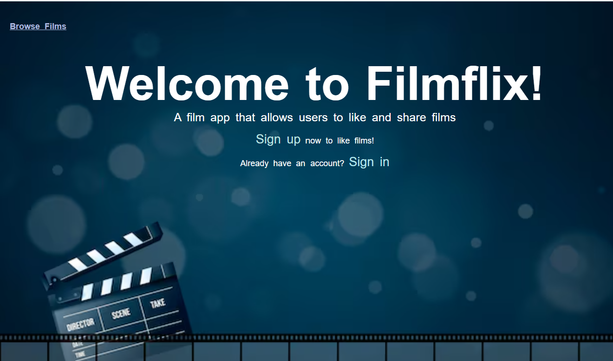

The name of my app is called Filmflix.

It is an app where you are able to upload and browse movies and interact with other users by liking films. As a none logged in user, you are able to to view movies, as a login in user you are able to view movies, create, update and delete films.  You are also able to 'like' films.

To enhance the app there are many things I would like to add, for instance the ability for logged in users to review a film a serch function and the ability to create a link to watch trailers.

https://trello.com/c/N2uH8p3s/9-erd

https://excalidraw.com/

https://trello.com/b/evg0pD3r/my-men-stack-crud-app-project

https://github.com/anneAC84/Filmflix.git

moongoose
css
HTML
MONGODB
Express